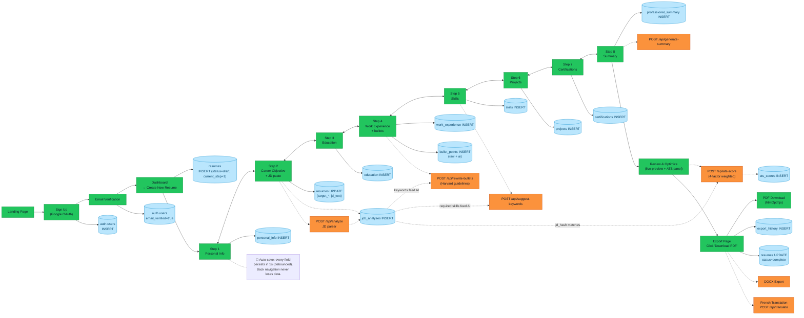

# User Journey Diagram Implementation Plan

> **For agentic workers:** REQUIRED SUB-SKILL: Use superpowers:subagent-driven-development (recommended) or superpowers:executing-plans to implement this plan task-by-task. Steps use checkbox (`- [ ]`) syntax for tracking.

**Goal:** Produce a FigJam swim-lane diagram and a companion markdown spec showing the new-user journey from sign-up through resume export, with MVP/Phase 2 color coding, DB tables, and AI API endpoints clearly marked.

**Architecture:** Documentation-only deliverable. No application code changes. The diagram is generated via the Figma MCP `generate_diagram` tool (FigJam target). The companion markdown lives in the user's Schiller school work folder, not in the repo. The design spec already exists at `docs/superpowers/specs/2026-04-28-user-journey-diagram-design.md` and is the source of truth.

**Tech Stack:** Figma MCP (`mcp__figma__generate_diagram`, schema loaded via ToolSearch), Markdown, git.

---

## File Structure

**Will be created:**
- `~/Documents/Shiller International University /School Work /Integrative Project III /ScopusResume_User_Journey_Diagram.md` — companion reference doc with full DB/API payload details and the FigJam URL

**Will be generated externally (not a file on disk):**
- A FigJam board on Figma, URL captured and embedded in the markdown above

**Will be committed to repo:**
- The existing design spec: `docs/superpowers/specs/2026-04-28-user-journey-diagram-design.md`
- This plan: `docs/superpowers/plans/2026-04-28-user-journey-diagram.md`

**Not modified:** Any application source code in `src/`, `api/`, etc.

---

## Task 1: Load Figma MCP tool schemas

**Files:** None — tool registration only.

- [ ] **Step 1: Load `generate_diagram` schema via ToolSearch**

Run the ToolSearch tool with:
```
query: select:mcp__figma__generate_diagram
max_results: 1
```

Expected: A `<functions>` block returns containing the full JSONSchema for `mcp__figma__generate_diagram`, making it callable.

- [ ] **Step 2: (Optional) Load `whoami` to confirm Figma auth**

Run ToolSearch with:
```
query: select:mcp__figma__whoami
max_results: 1
```

Then call `mcp__figma__whoami` (no args) to verify the Figma MCP is authenticated. If it returns an error, stop and ask the user to authenticate before continuing.

Expected: A user identity object, or a clear auth error message.

---

## Task 2: Generate the FigJam board

**Files:** None on disk — output is a FigJam URL returned by the tool.

- [ ] **Step 1: Build the diagram description**

The Figma `generate_diagram` tool accepts a structured description of the diagram. Build the description from the design spec. Use this Mermaid-style flowchart specification (the MCP tool will convert it to FigJam shapes):



- [ ] **Step 2: Call `mcp__figma__generate_diagram`**

Pass the Mermaid spec from Step 1 as the diagram description. The exact parameter name comes from the schema loaded in Task 1 — likely `code`, `diagram`, or `description`. Title the board: `"ScopusResume — New User Journey (Apr 2026)"`.

Expected: The tool returns a Figma/FigJam URL. Capture it.

- [ ] **Step 3: Verify the board renders**

Open the returned URL in a browser (or use `mcp__figma__get_screenshot` with the file key from the URL) to confirm the diagram is readable and the swim lanes/colors look right.

- [ ] **Step 4: If the board is malformed, iterate**

If the diagram is too cramped, illegible, or the swim lanes didn't form, regenerate with adjustments:
- Simplify by removing the JD-thread dotted lines and adding them as a separate annotation
- Or split into two diagrams: one for auth+wizard, one for review+export
- Re-call `generate_diagram` and capture the new URL

Stop when the board is legible. Save the final URL.

---

## Task 3: Write the companion markdown

**Files:**
- Create: `~/Documents/Shiller International University /School Work /Integrative Project III /ScopusResume_User_Journey_Diagram.md`

- [ ] **Step 1: Write the companion markdown using the Write tool**

Use this exact content (substitute `<FIGJAM_URL>` with the URL from Task 2):

```markdown
# ScopusResume — New User Journey Diagram

**Companion document for:** [FigJam Board](<FIGJAM_URL>)
**Date:** 2026-04-28
**Author:** Shomer A. Kayit (CS353 Integrative Project III, Schiller International University)
**Related:** ScopusResume Feature Specification.pdf, ScopusResume_Technical_Specification.pdf

---

## Color Legend

- 🟩 **MVP (Green)** — In scope for the academic submission. Auth, dashboard, all 8 wizard step UIs and their persistence, PDF export.
- 🟧 **Phase 2 (Orange)** — Planned but out of MVP. JD analysis, AI bullet rewriting, AI skill suggestions, AI summary generation, ATS scoring engine, DOCX export, French translation.

## Diagram Layout

The FigJam board uses 4 horizontal swim lanes × 14 vertical phase columns:

| Lane | Contents |
|------|---------|
| User | Actions (clicks, form fills, paste JD, click Export) |
| Frontend (React) | Pages and components |
| Supabase (Postgres + Auth) | Table writes |
| AI API (OpenAI via Vercel /api/*) | Endpoint calls |

## The 14 Phases

| # | Phase | MVP/Phase 2 |
|---|-------|-------------|
| 1 | Landing page | 🟩 |
| 2 | Sign Up (Google OAuth) | 🟩 |
| 3 | Email verification | 🟩 |
| 4 | Dashboard → "Create New Resume" | 🟩 |
| 5 | Step 1 — Personal Info | 🟩 |
| 6 | Step 2 — Career Objective + JD paste | 🟩 (UI/storage); 🟧 (analysis) |
| 7 | Step 3 — Education | 🟩 |
| 8 | Step 4 — Work Experience + bullets | 🟩 (UI/storage); 🟧 (AI rewrite) |
| 9 | Step 5 — Skills | 🟩 (UI/storage); 🟧 (AI suggestions) |
| 10 | Step 6 — Projects | 🟩 |
| 11 | Step 7 — Certifications | 🟩 |
| 12 | Step 8 — Summary | 🟩 (UI/storage); 🟧 (AI generation) |
| 13 | Review & Optimize | 🟩 (preview); 🟧 (ATS scoring) |
| 14 | Export PDF (+ Phase 2 branches: DOCX, French) | 🟩 (PDF); 🟧 (DOCX, FR) |

## The JD ↔ AI Connection Thread

The diagram visually answers: *"How is the CV connected to the analysis of the job offer?"*

1. **JD enters at Step 2 (Career Objective).** User pastes the job description into a textarea (max 10,000 chars). MVP captures the raw text into `resumes.job_description_text`. 🟩
2. **JD is analyzed (Phase 2).** `POST /api/analyze` returns structured data and writes to `job_analyses`. 🟧
3. **JD analysis powers AI suggestions across later steps:**
   - Step 4 → `POST /api/rewrite-bullets` uses `job_analyses.keywords`. 🟧
   - Step 5 → `POST /api/suggest-keywords` uses `job_analyses.required_skills`. 🟧
   - Step 8 → `POST /api/generate-summary` uses `job_analyses` + resume context. 🟧
4. **JD drives the final ATS score at Step 13.** `POST /api/ats-score` reads the resume + cached `job_analyses` (matched via `jd_hash`) and returns a 4-factor weighted score. 🟧

## Database Tables Touched

| Table | Purpose | Written at phase |
|-------|---------|-----------------|
| `auth.users` (Supabase managed) | Accounts, OAuth, email_verified | 2, 3 |
| `resumes` | Top-level resume; tracks `current_step`, `status`, JD text | 4, 5–13 (UPDATE) |
| `personal_info` | 1:1 — contact, links | 5 |
| `education` | Repeatable | 7 |
| `work_experience` | Repeatable | 8 |
| `bullet_points` | FK to experience — `raw_text`, `ai_text`, `is_using_ai` | 8 |
| `skills` | FK to resume — category enum | 9 |
| `projects` | Repeatable | 10 |
| `certifications` | Repeatable | 11 |
| `professional_summary` | 1:1 — `summary_text`, `is_ai_generated` | 12 |
| `job_analyses` 🟧 | Structured JD parse | 6 |
| `ats_scores` 🟧 | Per `(resume_id, jd_hash)` | 13 |
| `export_history` | One row per export | 14 |

### Representative SQL

**Phase 4 — Initial resume creation:**
```sql
INSERT INTO resumes (id, user_id, title, status, current_step, created_at)
VALUES (gen_random_uuid(), :user_id, 'Untitled Resume', 'draft', 1, now())
RETURNING id;
```

**Phase 8 — Bullet point upsert with both raw and AI text:**
```sql
INSERT INTO bullet_points (id, experience_id, raw_text, ai_text, is_using_ai, display_order)
VALUES (gen_random_uuid(), :experience_id, :raw, :ai, :is_using_ai, :order)
ON CONFLICT (id) DO UPDATE
SET raw_text = EXCLUDED.raw_text,
    ai_text = EXCLUDED.ai_text,
    is_using_ai = EXCLUDED.is_using_ai,
    display_order = EXCLUDED.display_order;
```

**Phase 13 — ATS score insert:**
```sql
INSERT INTO ats_scores (
  id, resume_id, jd_hash,
  keyword_score, format_score, impact_score, completeness_score,
  total_score, missing_keywords, suggestions, computed_at
) VALUES (
  gen_random_uuid(), :resume_id, :jd_hash,
  :keyword, :format, :impact, :completeness,
  :total, :missing_kw_jsonb, :suggestions_jsonb, now()
);
```

## AI API Endpoints (OpenAI via Vercel serverless functions)

All endpoints use the OpenAI Chat Completions API via `api/_openai.js` (env var `OPENAI_KEY`). Rate limit: 20 req/min per user.

### `POST /api/analyze` 🟧 — Phase 6
**Request:**
```json
{ "jd_text": "string (max 10000 chars)" }
```
**Response:**
```json
{
  "required_skills": ["string"],
  "preferred_skills": ["string"],
  "keywords": [{ "term": "string", "count": 0 }],
  "seniority": "junior|mid|senior",
  "culture_signals": ["string"]
}
```

### `POST /api/rewrite-bullets` 🟧 — Phase 8
**Request:**
```json
{
  "raw_description": "string",
  "jd_keywords": ["string"]
}
```
**Response:**
```json
{ "bullets": ["string", "string", "string"] }
```
(3–5 bullets, Harvard guidelines, action verbs, quantified results)

### `POST /api/suggest-keywords` 🟧 — Phase 9
**Request:**
```json
{
  "current_skills": ["string"],
  "jd_required_skills": ["string"]
}
```
**Response:**
```json
{ "suggested_skills": ["string"] }
```

### `POST /api/generate-summary` 🟧 — Phase 12
**Request:**
```json
{
  "experience_summary": "string",
  "top_skills": ["string"],
  "target_role": "string"
}
```
**Response:**
```json
{ "summary_text": "string (3-4 sentences)" }
```

### `POST /api/ats-score` 🟧 — Phase 13
**Request:**
```json
{ "resume_id": "uuid", "jd_hash": "string" }
```
**Response:**
```json
{
  "keyword_score": 0,
  "format_score": 0,
  "impact_score": 0,
  "completeness_score": 0,
  "total": 0,
  "missing_keywords": ["string"],
  "suggestions": ["string"]
}
```

### `POST /api/translate` 🟧 — Phase 14 (Phase 2 export branch)
**Request:**
```json
{ "resume_id": "uuid", "target_lang": "fr" }
```
**Response:**
```json
{ "translated_resume": { } }
```

## Back Navigation & Auto-save

- The wizard renders inside `ResumeBuilderPage`, routing between the 8 step components based on `resumes.current_step`.
- Every field change is debounced 1s (via `useAutoSave`) and persisted to its respective table.
- Clicking "Back" decrements the route — non-destructive. Previous step data is rehydrated from Supabase.
- Visualized in the diagram by **bidirectional arrows** between phases 5–12 plus a single annotation block.

## Out of Scope (mentioned for completeness, not drawn)

- Account settings page (profile edits, password change, GDPR data export)
- Password reset flow
- Resume list management on dashboard (duplicate, delete, rename)
- Returning-user journey (this diagram is the **new user** flow)
```

- [ ] **Step 2: Verify the file was written**

Run: `ls -la "/Users/sk_hga/Documents/Shiller International University /School Work /Integrative Project III /ScopusResume_User_Journey_Diagram.md"`
Expected: File listed, non-zero size.

- [ ] **Step 3: Open the file to confirm formatting**

Run: `open -a "Markdown viewer of choice" "/Users/sk_hga/Documents/Shiller International University /School Work /Integrative Project III /ScopusResume_User_Journey_Diagram.md"` — or just visually inspect via Read.

Expected: The FigJam URL clickable, color legend visible, all 6 API endpoints present.

---

## Task 4: Commit the design spec and plan to git

**Files:**
- Modify: git tree (commits the design spec + this plan)

- [ ] **Step 1: Confirm what will be committed**

Run:
```bash
git -C /Users/sk_hga/ScopusResume/scopus status --short docs/superpowers/specs/2026-04-28-user-journey-diagram-design.md docs/superpowers/plans/2026-04-28-user-journey-diagram.md
```

Expected: Two `??` (untracked) lines for the spec and the plan.

- [ ] **Step 2: Stage the spec and plan only**

```bash
git -C /Users/sk_hga/ScopusResume/scopus add docs/superpowers/specs/2026-04-28-user-journey-diagram-design.md docs/superpowers/plans/2026-04-28-user-journey-diagram.md
```

Note: Do **not** add the companion markdown — it lives outside the repo by design.

- [ ] **Step 3: Commit**

```bash
git -C /Users/sk_hga/ScopusResume/scopus commit -m "$(cat <<'EOF'
docs: add user journey diagram spec and plan

Design spec and implementation plan for the academic deliverable:
a FigJam swim-lane diagram of the new-user journey from sign-up
through resume export, with MVP/Phase 2 color coding, DB tables,
and AI API endpoints. Companion markdown lives in the Schiller
school work folder (outside this repo).

Co-Authored-By: Claude Opus 4.7 <noreply@anthropic.com>
EOF
)"
```

- [ ] **Step 4: Verify the commit**

Run: `git -C /Users/sk_hga/ScopusResume/scopus log -1 --stat`
Expected: One commit with the two markdown files listed.

---

## Done Criteria

- [x] FigJam board exists at a captured URL, renders correctly with 4 swim lanes and color-coded phases
- [x] Companion markdown exists at `~/Documents/Shiller International University /School Work /Integrative Project III /ScopusResume_User_Journey_Diagram.md` and contains the FigJam URL
- [x] Design spec and this plan are committed to git
- [x] No application source code modified
